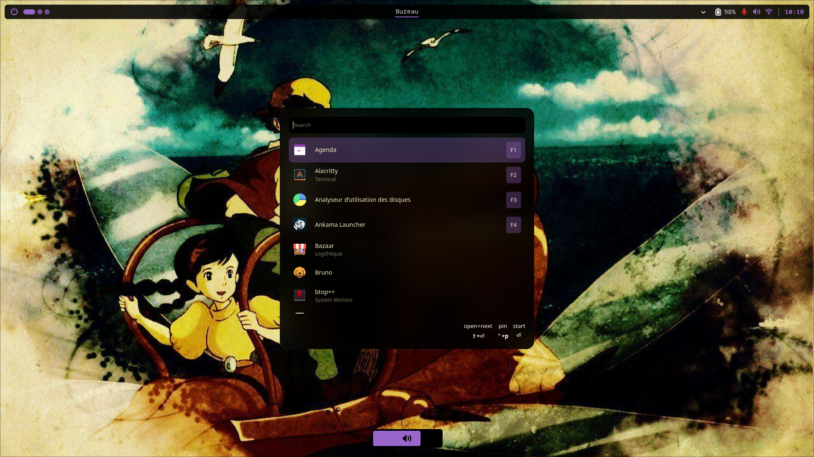
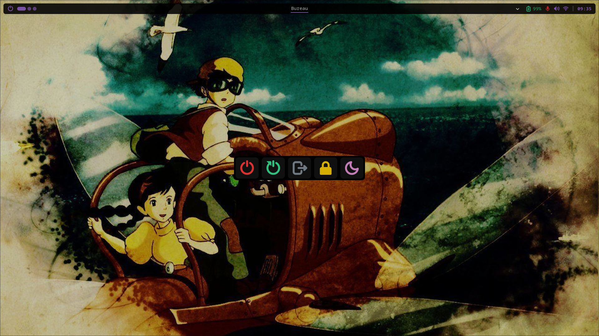

# Astria Shell

**Astria Shell** is an elegant, modular desktop shell for Wayland compositors (**Hyprland**, **Niri**, and **Mango**), built with [AGS (Aylur's GTK Shell)](https://github.com/aylur/ags) v2, Astal, GTK4, TypeScript, and SCSS.

<p align="center">
  
</p>

## Table of Contents

- [Features](#features)
- [Technologies](#technologies)
- [Getting Started](#getting-started)
  - [Prerequisites](#prerequisites)
  - [Installation with Nix & Home Manager](#installation-with-nix--home-manager)
  - [Development Setup](#development-setup)
- [IPC & Remote Controls](#ipc--remote-controls)
  - [Commands](#commands)
  - [Keybinding Examples](#keybinding-examples)
- [Project Structure](#project-structure)
- [Theming & Customization](#theming--customization)
- [Author](#author)
- [License](#license)

## Features

- **Dynamic Status Bar**
  - **Power Menu Launcher**: Quick trigger for the session power menu overlay.
  - **Workspaces**: Native, dynamic workspace indicators tailored for **Hyprland**, **Niri**, and **Mango** (automatically detected via `XDG_CURRENT_DESKTOP`). Includes per-monitor workspace isolation where supported. Fallback support is available for other desktop environments.
  - **Window Title / Info**: Active window name, application class tracker, and special workspace / fullscreen indicator.
  - **System Tray**: Integrated Status Notifier Items (SNI) tray with a collapsible popover drawer.
  - **Quick Menu & Status Chips**: Audio (Speaker & Microphone), Wi-Fi, Ethernet, Bluetooth, Battery, and Idle Inhibit state indicators with interactive popups and controls.
  - **Clock & Date**: Formatted date/time display with custom tooltips.

- **On-Screen Display (OSD / Levels)**
  - Interactive on-screen indicators for **Speaker Volume**, **Microphone Volume**, and **Screen Brightness**.
  - Animated popup sliders triggered on value changes or via IPC commands, with hover persistence and auto-dismissal.

- **Notification Center**
  - Built-in notification system powered by `AstalNotifd`.
  - Smooth slide animations, action buttons, and automatic dismissals.
  - **Fullscreen Awareness**: Automatically adjusts layout and exclusivity when a fullscreen window is active.

- **Power Menu (Session Controls)**
  - Fullscreen overlay modal with session controls: _Shutdown_, _Reboot_, _Logout_, _Lock Screen_, and _Suspend_.
  - Full keyboard navigation support (Arrow keys, Vim keys `h/j/k/l`, `Enter`, and `Escape`).

<p align="center">
  
</p>

- **Background Daemons & Services**
  - **Battery Daemon**: Real-time battery monitoring and low-level / full-battery notifications.
  - **Brightness Daemon**: Min-brightness safety enforcement and backlight management.
  - **Media Daemon**: MPRIS-based media tracker that automatically pauses playing audio on sink switches or disconnections.
  - **Idle Service**: Sleep prevention and idle inhibition manager.

- **Modular SCSS Theming**
  - Modern aesthetic built on GTK4 CSS styling.
  - Color palette switcher with bundled themes (_Dark_, _Light_, _Nordic_).

## Technologies

- **Framework**: [AGS (Astal / GJS)](https://github.com/aylur/ags) + GTK4
- **Language**: TypeScript / TSX
- **Styling**: SCSS
- **Packaging & Environment**: Nix Flakes (Multi-architecture: `x86_64-linux`, `aarch64-linux`) + Home Manager

## Getting Started

### Prerequisites

- Nix with Flakes enabled (recommended), or a working AGS v2 installation with GTK4 and Astal libraries.
- Wayland compositor: Tailored for [Hyprland](https://hyprland.org/), [Niri](https://github.com/YaLTeR/niri), and [Mango](https://github.com/mango-wc/mango) (other compositors and desktop environments are supported via fallback desktop managers).

### Installation with Nix & Home Manager

Astria Shell provides a Home Manager module exported from `flake.nix`.

1. **Add to your Flake inputs:**

```nix
{
  inputs = {
    nixpkgs.url = "github:nixos/nixpkgs/nixos-unstable";

    astria-shell = {
      url = "github:thomas-btst/astria-shell";
      inputs.nixpkgs.follows = "nixpkgs";
    };
  };
}
```

1. **Import the Home Manager module:**

```nix
{ inputs, ... }: {
  imports = [
    inputs.astria-shell.homeModules.default
  ];

  programs.astria-shell = {
    enable = true;
  };
}
```

### Development Setup

To work on Astria Shell locally using Nix development shells:

1. **Clone the repository:**

```bash
git clone https://github.com/thomas-btst/astria-shell.git
cd astria-shell
```

1. **Initialize TypeScript types & dependencies:**

```bash
nix develop .#init
```

_(Generates Astal & GTK4 TypeScript definitions in `./@girs/`, installs node modules, and links local typings)_

1. **Start the development environment:**

- **Standard development shell:**

  ```bash
  nix develop
  ```

  _(Provides `ags`, `alejandra`, `statix`, `deadnix`, and required dependencies)_

- **Auto-run development shell:**

  ```bash
  nix develop .#dev
  ```

  _(Launches `ags run -d .` automatically upon entering the shell)_

1. **Linting and code formatting:**

```bash
npm run lint
```

## IPC & Remote Controls

Astria Shell includes an IPC request handler ([`request.ts`](./request.ts)) allowing external scripts, keybindings, or window manager configurations to trigger overlays and OSDs.

### Commands

| Action                  | Command                               | Description                               |
| :---------------------- | :------------------------------------ | :---------------------------------------- |
| **Toggle Power Menu**   | `ags request "toggle powermenu"`      | Toggles the session power menu overlay    |
| **Show Speaker OSD**    | `ags request "show level speaker"`    | Displays the speaker volume OSD slider    |
| **Show Mic OSD**        | `ags request "show level microphone"` | Displays the microphone volume OSD slider |
| **Show Brightness OSD** | `ags request "show level brightness"` | Displays the brightness OSD slider        |

### Keybinding Examples

#### Hyprland (`hyprland.conf`)

```ini
# Power Menu
bind = , XF86PowerOff, exec, ags request toggle powermenu
bind = SUPER SHIFT, E, exec, ags request toggle powermenu

```

#### Niri (`config.kdl`)

```kdl
binds {
    Mod+Shift+E { spawn "ags" "request" "toggle powermenu"; }
    XF86PowerOff { spawn "ags" "request" "toggle powermenu"; }
}
```

#### Mango (`config.toml`)

```toml
# Power Menu
bind=SUPER+SHIFT,e,spawn,ags request toggle powermenu
bind=none,XF86PowerOff,spawn,ags request toggle powermenu
```

## Project Structure

```text
astria-shell/
├── app.tsx                 # AGS application entry point
├── request.ts              # IPC CLI request router (toggle, show)
├── flake.nix               # Multi-arch Nix Flake definition
├── module.nix              # Home Manager module integration
├── shell.nix               # Nix development environments (default, dev, init)
├── style.scss              # Root SCSS stylesheet
│
├── daemons/                # Background watchers (Battery, Brightness, Media)
├── services/               # Core service abstractions (Audio, Battery, Brightness, Clock)
│   └── desktop_manager/    # Compositor abstraction layer (Hyprland, Niri, Mango, Default)
├── windows/                # Window overlays & bar definition
│   ├── bar/                # Status bar & modules (workspaces, trays, powermenu launcher, clock, info)
│   ├── levels/             # OSD popups (speaker, microphone, brightness)
│   ├── notifications/      # Notification popup overlay
│   └── powermenu/          # Fullscreen session overlay modal
├── widgets/                # Reusable UI widgets & level sliders
├── style/                  # Modular styles & color themes (dark, light, nordic)
└── utils/                  # GTK, environment, locker, and helper utilities
```

## Theming & Customization

- Configuration parameters like bar dimensions, margins, and icon sizes can be tuned in [`utils/env.ts`](./utils/env.ts) and [`style/env.scss`](./style/env.scss).
- Color palettes and theme variants are defined under [`style/colors/`](./style/colors/).

## Author

- **Name**: Thomas BATISTA
- **Website**: [thomas-batista.fr](https://thomas-batista.fr)

## License

© Thomas BATISTA. All rights reserved.
